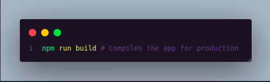

# gam3r.store

gam3r.store is a modern e-commerce platform for gamers, built with cutting-edge technologies to provide a seamless shopping experience.

## Features

- Responsive web design for desktop and mobile devices
- User authentication and profile management
- Product catalog with advanced search and filtering
- Shopping cart and checkout process
- Order tracking and history
- Admin panel for product and order management
- Integration with popular payment gateways
- Real-time inventory updates
- Customer reviews and ratings system
- Wishlist functionality

## Technologies Used

### Frontend

### Backend

### DevOps & Tools

## Getting Started

To run the development server:

To build the project:

For more detailed instructions, please refer to the individual README files in the apps/frontend and apps/backend directories.

## Connect with Me

**Made with 💜 by [@designtechti490](https://github.com/designtechti490)**
